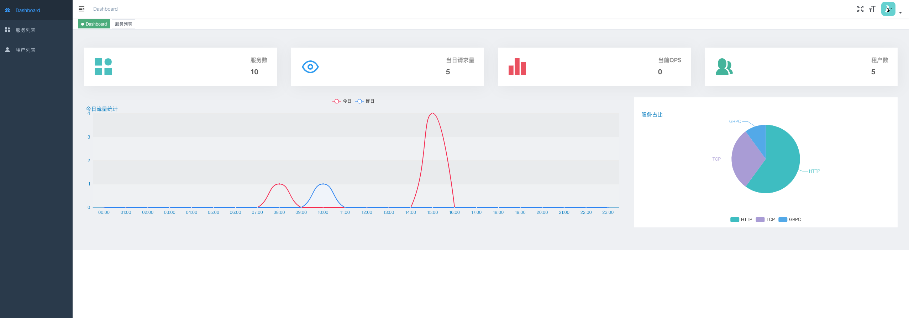
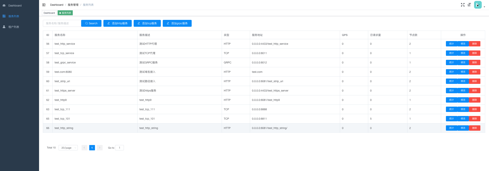
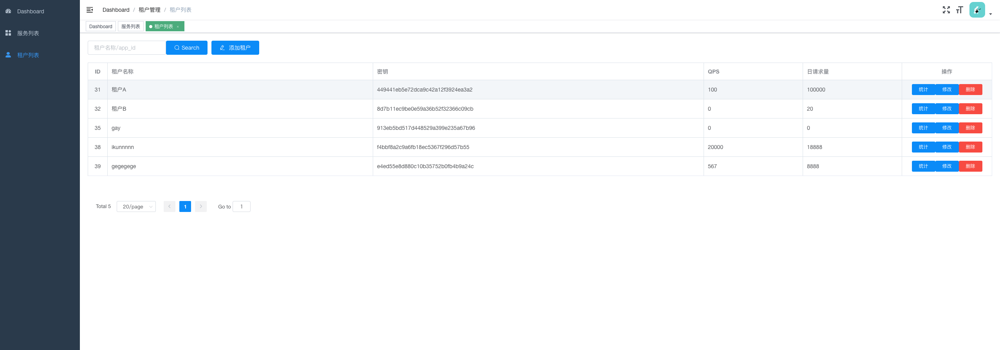
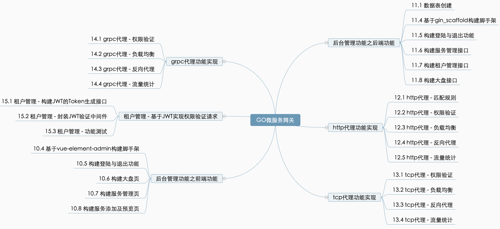

<div align="center">

<h3 align="center">Micro Gateway</h3>
  <p align="center">
    🧱一个高性能微服务网关
    <br />
  </p>
</div>

### Micro Gateway 管理后台Demo



### ✨功能

### 🔧技术栈
#### 后端
- Golang
- Gin
- Gorm
- Redis
- MySql
- Swagger
- Docker
#### 前端
- Vue.js
- Vue-element-admin

### 🚀快速开始
- Golang版本要求Golang1.12+
- 下载类库依赖
```shell
export GO111MODULE=on && export GOPROXY=https://goproxy.cn
cd mirco_gateway
go mod tidy
```
- 创建数据库并导入
```shell
mysql -h localhost -u root -p -e "CREATE DATABASE mirco_gateway DEFAULT CHARACTER SET utf8 COLLATE utf8_general_ci;"
mysql -h localhost -u root -p mirco_gateway < gateway.sql --default-character-set=utf8
```
#### 后端部署
##### 直接运行
```shell
make build_dev
sh run.sh
```
##### 使用Docker部署  
- 部署网关管理服务
```shell
docker run --name dashboard --net host -e TZ=Asia/Shanghai -d dockerfile-dashboard:latest
```
- 部署代理服务
```shell
docker run --name gateway_server --net host -e TZ=Asia/Shanghai -d dockerfile-server:latest
```
#### Dashboard部署
- 方式一: Dashboard前端与后端服务分开部署  
  - 在`vue.config.js`文件中设置`publicPath`为`/`
  - 在`.env.production`文件中设置`VUE_APP_BASE_API`为自己需要的url前缀，本项目设置为`/prod-api`。
  - 编译。
  ```sh
  npm run build:prod
  ```
  - 通过nginx代理实现与后端接口服务的同域访问。
  ```sh
   server {
        listen       8884;
        server_name  localhost;
        root /dashboard编译生成的结果的路径;
        index  index.html index.htm index.php;

        location / {
            try_files $uri $uri/ /index.html?$args;
        }

        location /prod-api/ {
            proxy_pass http://127.0.0.1:8880/; #后端服务接口
        }
  }
  ```
  - 访问`http://你的ip:8884`即可。
- 方式二：与后端项目合并部署。  
  - 在`vue.config.js`文件中设置`publicPath`为`/dist`
  - 在`.env.production`文件中设置`VUE_APP_BASE_API`为空。
  - 在后端项目的`router`包的`route.go`文件中增加代码
  ```go
  router.Static("/dist", "./dist")
  ``` 
  - 编译后放入到后端项目的根目录下。
  - 访问`http://后端IP:后端port/dist`

#### 测试  
- `example`目录为模拟下游服务节点的代码。

#### 代理规则
- `HTTP/HTTPS`代理：通过`HttpRule.Rule`字段以前缀匹配的形式实现不同下游服务的转发
- `TCP`代理：通过`TcpRule.Port`字段实现不同tcp服务的转发
- `GRPC`代理：通过`GrpcRule.Port`字段实现不同GRPC服务的转发


### 💻API文档
生成接口文档：swag init  
然后启动服务器：go run main.go，浏览地址: http://127.0.0.1:8880/swagger/index.html